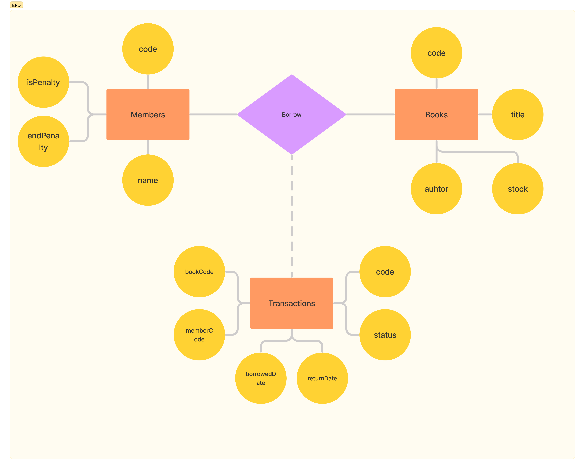

# Books Lending App

## Description

Backend Technical Test PT Eigen Tri Mathema

### ERD



### Use Case

* Members can borrow books with conditions
  * [X] Members may not borrow more than 2 books
  * [X] Borrowed books are not borrowed by other members
  * [X] Member is currently not being penalized
* Member returns the book with conditions
  * [X] The returned book is a book that the member has borrowed
  * [X] If the book is returned after more than 7 days, the member will be subject to a penalty. Member with penalty cannot able to borrow the book for 3 days
* Check the book
  * [X] Shows all existing books and quantities
  * [X] Books that are being borrowed are not counted
* Member check
  * [X] Shows all existing members
  * [X] The number of books being borrowed by each member

## Installation

```bash
$ yarn install
```

## Database

Buat file `.env` dari file `.env.example` dan masukkan URL database

```yaml
# Database
DATABASE_URL=postgres://<username>:<password>@localhost:5432/postgres
```

Jalankan migrasi

```bash
# run migration
npx prisma migrate
```

## Running the app

```bash
# development
$ yarn run start

# watch mode
$ yarn run start:dev

# production mode
$ yarn run start:prod
```

## Test

```bash
# unit tests
$ yarn run test
```

# Algoritma

Hasil untuk test algoritma ada pada direktori

```bash
|- 📁 algoritma
|--- ...
|- 📁 src
|--- ...
|- ...

```
